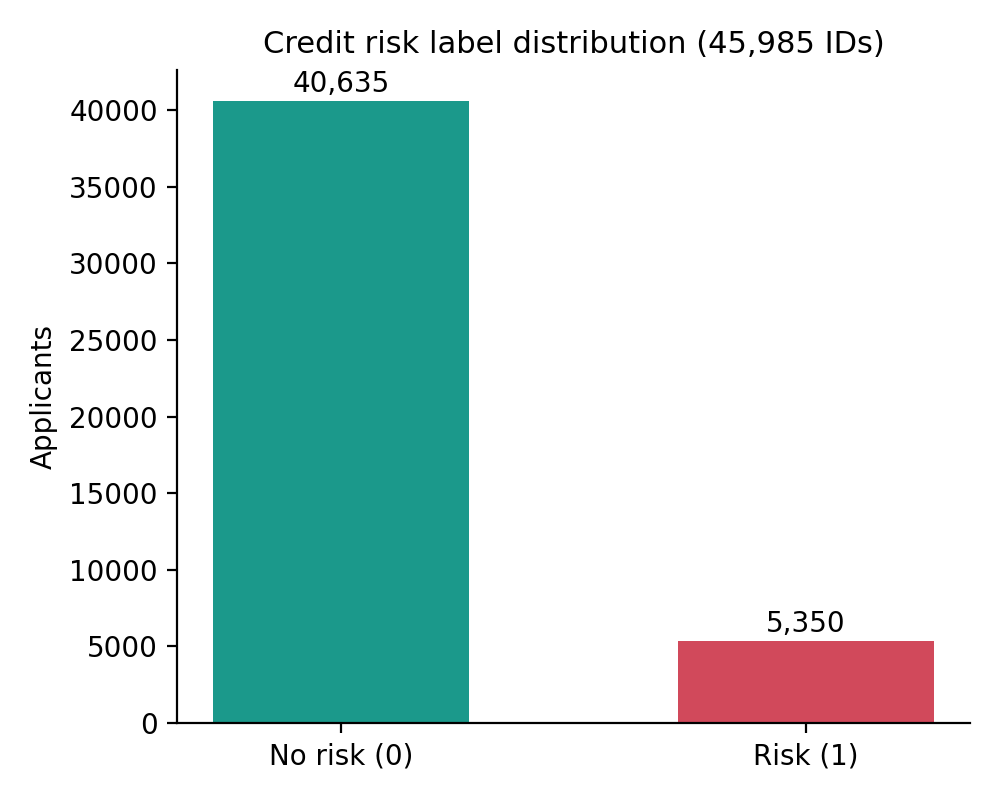
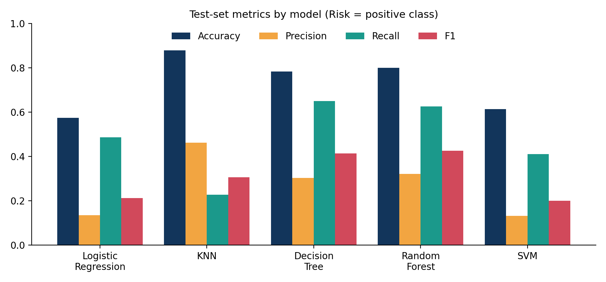
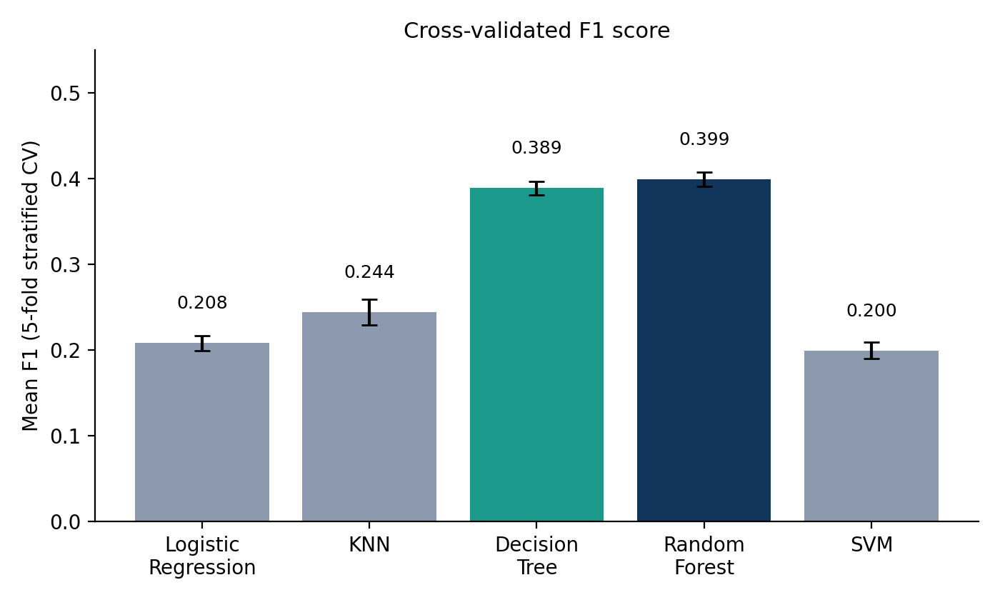
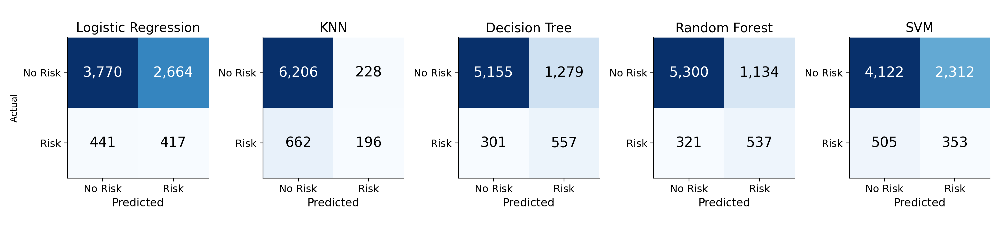

# Credit Card Approval Risk Prediction

A machine-learning project that predicts whether a credit card applicant is a **credit risk** (has had a delinquent payment history) using demographic and employment data from their application. Five classifiers are built on a shared preprocessing pipeline, compared on a held-out test set and with 5-fold cross-validation.

  

---

## Table of Contents
1. [Problem Statement](#problem-statement)
2. [Dataset](#dataset)
3. [Project Workflow](#project-workflow)
4. [Feature Engineering & Preprocessing](#feature-engineering--preprocessing)
5. [Models](#models)
6. [Results](#results)
7. [Key Takeaways](#key-takeaways)
8. [Known Limitations](#known-limitations)
9. [Future Work](#future-work)
10. [Installation & Usage](#installation--usage)
11. [Repository Structure](#repository-structure)

---

## Problem Statement
Banks must decide quickly whether to approve a credit card application. Approving a customer who later defaults is expensive; rejecting a good customer loses revenue. This project builds a binary classifier that flags applicants likely to become a credit risk, based only on information available at application time.

## Dataset
**Source:** [Credit Card Approval Prediction](https://www.kaggle.com/datasets/rikdifos/credit-card-approval-prediction) (Kaggle, `rikdifos`), downloaded with `kagglehub`.

| File | Rows | Columns | Description |
|---|---|---|---|
| `application_record.csv` | 438,557 | 18 | Applicant demographics, income, employment, housing, contact flags |
| `credit_record.csv` | 1,048,575 | 3 | Monthly repayment status per applicant (`ID`, `MONTHS_BALANCE`, `STATUS`) |

- `credit_record` covers **45,985** unique applicants; after an inner join on `ID`, **36,457** applicants have both application data and credit history.
- No exact duplicate rows in either file. The only missing values are in `OCCUPATION_TYPE` (134,203 rows in the application file).

### Target definition
`STATUS` codes in `credit_record`: `C` paid off, `X` no loan that month, `0` 1–29 days past due, `1` 30–59, `2` 60–89, `3` 90–119, `4` 90–119 (severe), `5` 120+ days past due.

An applicant is labelled **`CREDIT_RISK = 1`** if they were **30+ days overdue (`STATUS` 1–5) in any month**, otherwise `0`.

| Class | Applicants (all 45,985 IDs) |
|---|---|
| No risk (0) | 40,635 |
| Risk (1) | 5,350 |

The classes are imbalanced. On the merged modelling set the test split has 6,434 no-risk vs 858 risk cases (~11.8% positive).



## Project Workflow
```
Download data ─► EDA ─► Feature engineering ─► Build target from credit_record
      ─► Merge on ID ─► Train/test split (80/20, stratified)
      ─► Preprocessing pipeline ─► Train 5 models ─► Evaluate ─► 5-fold CV
```

## Feature Engineering & Preprocessing
**Derived features**
- `AGE` = `-DAYS_BIRTH / 365` (years, integer)
- `YEARS_EMPLOYED` = `|DAYS_EMPLOYED| / 365`; the sentinel value `365243` (used for people with no current employment) is set to `0`
- `EMPLOYMENT_STATUS` = `employed` if `YEARS_EMPLOYED > 0` else `unemployed` (329,600 / 108,957 in the application file)
- `OCCUPATION_TYPE` missing values filled with `"Unknown"`

**Dropped columns:** `ID`, `DAYS_BIRTH`, `DAYS_EMPLOYED` (replaced by derived features), `FLAG_MOBIL` (constant, every applicant = 1).

**Final feature set (17 features)**

| Type | Features |
|---|---|
| Numerical (8) | `CNT_CHILDREN`, `AMT_INCOME_TOTAL`, `FLAG_WORK_PHONE`, `FLAG_PHONE`, `FLAG_EMAIL`, `CNT_FAM_MEMBERS`, `AGE`, `YEARS_EMPLOYED` |
| Categorical (9) | `CODE_GENDER`, `FLAG_OWN_CAR`, `FLAG_OWN_REALTY`, `NAME_INCOME_TYPE`, `NAME_EDUCATION_TYPE`, `NAME_FAMILY_STATUS`, `NAME_HOUSING_TYPE`, `OCCUPATION_TYPE`, `EMPLOYMENT_STATUS` |

**Pipeline:** a `ColumnTransformer` applies `StandardScaler` to numerical columns and `OneHotEncoder(handle_unknown="ignore")` to categorical columns. It sits inside each model's `sklearn.pipeline.Pipeline`, so scaling/encoding are fitted on training data only.

**Split:** 80/20 `train_test_split`, `random_state=42`, `stratify=y` → 29,165 train / 7,292 test rows.

## Models
| Model | Key settings |
|---|---|
| Logistic Regression | `max_iter=1000`, `class_weight="balanced"` |
| K-Nearest Neighbors | `n_neighbors=5` (no class weighting) |
| Decision Tree | `random_state=42`, `class_weight="balanced"` |
| Random Forest | `n_estimators=200`, `class_weight="balanced"`, `random_state=42` |
| SVM | `kernel="linear"`, `class_weight="balanced"` |

## Results
Metrics below treat **Risk as the positive class**.

| Model | Accuracy | Precision | Recall | F1 |
|---|---|---|---|---|
| Logistic Regression | 0.574 | 0.135 | 0.486 | 0.212 |
| KNN | **0.878** | **0.462** | 0.228 | 0.306 |
| Decision Tree | 0.783 | 0.303 | **0.649** | 0.414 |
| **Random Forest** | 0.800 | 0.321 | 0.626 | **0.425** |
| SVM | 0.614 | 0.132 | 0.411 | 0.200 |



**5-fold stratified cross-validation (F1 on the training set)**

| Model | Fold 1 | Fold 2 | Fold 3 | Fold 4 | Fold 5 | Mean |
|---|---|---|---|---|---|---|
| Logistic Regression | 0.194 | 0.221 | 0.212 | 0.205 | 0.207 | 0.208 |
| KNN | 0.242 | 0.266 | 0.244 | 0.220 | 0.247 | 0.244 |
| Decision Tree | 0.391 | 0.375 | 0.399 | 0.388 | 0.392 | 0.389 |
| Random Forest | 0.406 | 0.385 | 0.407 | 0.397 | 0.401 | 0.398 |
| SVM | 0.190 | 0.209 | 0.212 | 0.196 | 0.191 | 0.200 |



**Confusion matrices (test set)**



## Key Takeaways
- **Random Forest is the best overall model** – highest F1 on both the test set (0.425) and cross-validation (mean ≈ 0.398), with stable scores across folds.
- **Decision Tree is close behind** and has the highest recall (0.649): it catches about 65% of risky applicants.
- **KNN's 88% accuracy is misleading.** Because ~88% of applicants are no-risk, predicting "no risk" almost always scores well. KNN finds only 23% of risky applicants.
- **Logistic Regression and linear SVM perform poorly** (F1 ≈ 0.20), suggesting the relationship between application features and risk is non-linear.
- Overall predictive power is modest: application-time demographics carry limited signal about future repayment behaviour.

## Known Limitations
- **Label definition is simple:** any single 30+ day delinquency marks a customer as risky, regardless of severity, recency or whether it was later repaid.
- **Class imbalance:** only ~12% positives; models trade precision for recall (precision peaks at 0.46).
- **Default thresholds:** predictions use the 0.5 / default decision rule; no threshold tuning or probability calibration.
- **No hyperparameter tuning** – all models use near-default settings.
- **Pensioners and `YEARS_EMPLOYED`:** the `365243` sentinel is mapped to 0 and labelled `unemployed`, which also covers retirees.
- **Sensitive attributes:** `CODE_GENDER` and `AGE` are used as features; check regulatory/fairness requirements before any real-world use.
- **Notebook hygiene:** dataset paths are hard-coded to a local Windows directory; the `confusion_matrix(...)` calls in the Logistic Regression and KNN cells reference a variable (`y_pred`) that was not updated for those models, so the printed matrices there are not theirs (correct matrices are shown in this README); there are trailing empty cells; no plots are produced in the notebook itself.

## Future Work
- Tune hyperparameters (`GridSearchCV` / `RandomizedSearchCV`) for Random Forest and boosting models.
- Try gradient boosting (XGBoost, LightGBM) and handle imbalance with SMOTE or threshold tuning.
- Use precision–recall curves / PR-AUC and choose an operating threshold from business costs.
- Engineer richer target/features from `credit_record` (delinquency count, months on book, worst status).
- Add feature importance and SHAP explanations; run a fairness audit.
- Package as a script/API (e.g. FastAPI or Streamlit) with the trained pipeline saved via `joblib`.

## Installation & Usage
```bash
git clone <your-repo-url>
cd <your-repo>
python -m venv .venv && source .venv/bin/activate   # Windows: .venv\Scripts\activate
pip install pandas numpy matplotlib scikit-learn kagglehub jupyter
jupyter notebook dataset.ipynb
```
1. The notebook downloads the data via `kagglehub.dataset_download("rikdifos/credit-card-approval-prediction")` (a Kaggle account/API credentials may be required).
2. Update the two `pd.read_csv(...)` paths to point at the folder printed by that cell (or use the `path` variable).
3. Run all cells top to bottom.

## Repository Structure
```
.
├── dataset.ipynb        # Full analysis: EDA, features, models, evaluation
├── README.md            # This file
└── assets/              # Charts used in this README
    ├── class_balance.png
    ├── model_comparison.png
    ├── cv_f1.png
    └── confusion_matrices.png
```

## Author
Neeresh
